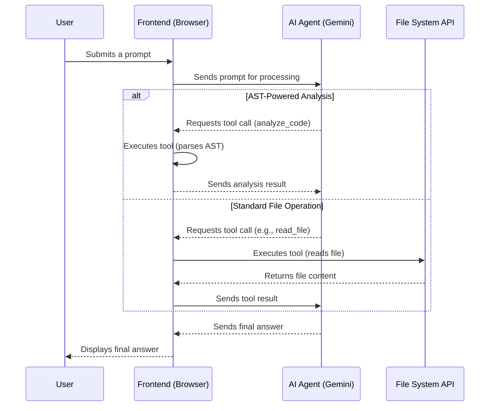

# AI-Powered Browser-Based Code Editor

This project is a sophisticated, browser-based code editor that integrates a powerful AI agent (Google's Gemini) to assist with a wide range of coding tasks. The application is designed with a secure, client-centric architecture, ensuring that all file system operations run directly in the browser, providing a seamless and safe user experience.

---

## Core Architecture

The editor's architecture has been streamlined to use a local Node.js server, simplifying setup and management.

*   **Local Node.js Server**: A lightweight `Express` server (`index.js`) now serves the `frontend` assets, making the application accessible at `http://localhost:3000`. This approach provides a stable and consistent runtime environment.

*   **Client-Centric File Operations**: All core logic and file system interactions remain securely on the client-side in `frontend/app.js`. The application uses the browser's native **File System Access API**, ensuring that all file operations are handled directly and safely by the user's browser.

*   **Stateful Experience with IndexedDB**: The application continues to use IndexedDB to persist user data locally, including API keys and the handle to the last used project directory.

---

## Features

*   **Monaco Editor**: Integrates the same powerful editor used in VS Code, providing a rich and familiar coding environment with syntax highlighting and advanced editing features.
*   **Gemini AI Agent**: A stateful AI assistant powered by the Google Gemini API with official tool-calling capabilities. The agent can understand context, use tools, and assist with tasks like code generation, file manipulation, and project-wide searches.
*   **Resizable Panels**: A flexible UI with resizable panels for the file tree, editor, and AI chat.
*   **Intelligent Tab Management**: Open, close, and switch between multiple files. The system is smart enough to recognize already-open files and simply switch to the correct tab instead of creating duplicates.
*   **Automatic File Opening**: When the AI agent reads, creates, or rewrites a file, it is automatically opened or focused, providing immediate visibility into the agent's actions.
*   **AST-Powered Code Analysis**: The AI can use the `analyze_code` tool to parse JavaScript code into an Abstract Syntax Tree (AST), enabling a deep, structural understanding of the code for more precise refactoring and analysis.
*   **Multimodal Input**: The AI chat supports both text and image uploads, allowing you to ask questions about visual content.
*   **Multiple Agent Modes**: Switch between different AI modes (`Code`, `Plan`, `Search`) to tailor the agent's behavior to your specific needs.

---

## Getting Started

Running the application is now managed by simple, powerful scripts for all major operating systems.

### Prerequisites

*   [Node.js](https://nodejs.org/) (which includes `npm`) installed on your system.

### Installation and Management

The application includes interactive scripts to handle all aspects of installation, execution, and process management.

1.  **Launch the Management Script**:
    *   **On Windows**: Double-click `app.bat`.
    *   **On macOS / Linux**: First, make the script executable by running `chmod +x ./app.sh`, then run it with `./app.sh`.

2.  **Install Dependencies (First-Time Setup)**:
    *   From the script's main menu, select **[1] Install Dependencies**. This will download the necessary `npm` packages and install `pm2` globally.

3.  **Start the Server**:
    *   From the menu, select **[2] Start Server**. This will launch the application using `pm2`.

4.  **Access the Application**:
    *   Open your web browser (e.g., Chrome, Edge) and navigate to **`http://localhost:3000`**.

The management scripts also provide options to **stop**, **restart**, and **monitor** the server, as well as **enable/disable auto-startup** on system reboot.

### Configuration

1.  **Add API Keys**:
    *   In the AI Chat panel, expand the "API Key Settings" section.
    *   Enter one or more Google Gemini API keys, separated by new lines.
    *   Click "Save Keys". The keys are stored securely in your browser's IndexedDB.

2.  **Open a Project**:
    *   Click the "Open Project Folder" button.
    *   Select a local directory to work with. The application will remember this folder for future sessions.

---

## Workflow Diagram

This diagram illustrates the core interaction loop between the user, the frontend, the AI agent, and the local file system.

---

