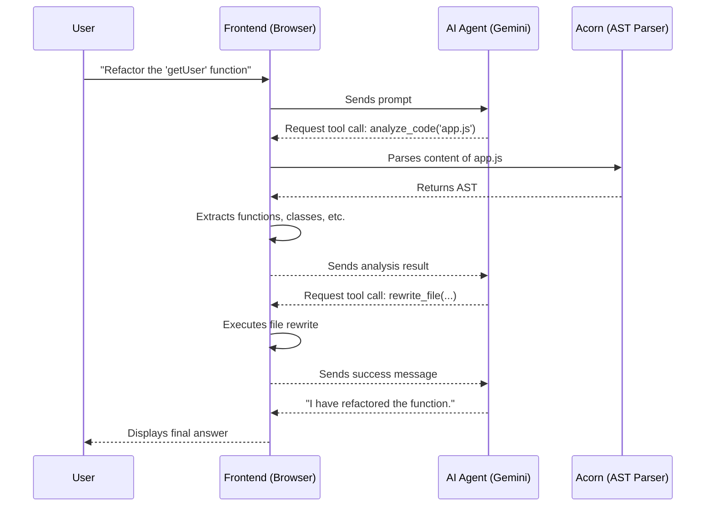

# Project Documentation: AI-Powered Browser-Based Code Editor

This document provides a comprehensive overview of the AI-Powered Code Editor, detailing its architecture, features, and the available toolset for the integrated AI agent.

---

### Core Architecture: Local Server and Client-Centric Logic

The application now runs as a local Node.js server, simplifying the setup process and providing a stable foundation for future enhancements.

*   **Local Server**: A lightweight `Express` server (`index.js`) is responsible for serving the `frontend` directory. This allows the application to be accessed consistently at `http://localhost:3000`.
*   **Client-Centric File Operations**: All interactions with the user's file system remain purely on the client-side, handled by `frontend/app.js`. The application uses the browser's native **File System Access API** (`window.showDirectoryPicker`) for all file and folder operations, ensuring security and context consistency.
*   **Folder Persistence**: The application continues to use **IndexedDB** to store a handle to the last opened directory. This allows for seamless project reconnection between sessions.

---

### AI Agent: Gemini with Official Tool Calling

The editor features a stateful AI agent powered by the **Google Gemini API** (`v1beta`) and its official tool-calling capabilities. This ensures a reliable and predictable conversational loop.

1.  **Tool Declaration**: The frontend formally declares its available functions to the Gemini API.
2.  **Function Call**: The AI responds with a structured `functionCall` when it needs to use a tool.
3.  **Frontend Execution**: The browser executes the requested function (e.g., reading a file).
4.  **Function Response**: The result is sent back to the AI in a formal `functionResponse`.
5.  **Final Answer**: The AI provides a natural-language response to the user.

A key enhancement to this loop is the introduction of the `analyze_code` tool, which allows the AI to develop a structural understanding of the code.

---

### Key Features and Workflow

#### Intelligent Tab and File Management
The editor's file management system is designed to be both robust and intuitive.
*   **Path-Based Identification**: Open files are tracked by their unique file path, which prevents the creation of duplicate tabs when a file is accessed multiple times.
*   **Automatic Focus**: When the AI uses a tool like `read_file` or `rewrite_file`, the application automatically opens the relevant file or switches to its existing tab, providing a seamless workflow.
*   **Stateful UI**: The file tree and open tabs are rendered dynamically, providing a clear and consistent view of the project state.

#### AST-Powered Code Analysis Workflow

---

### Setup and Management

The application is now managed via cross-platform scripts that handle installation, server operations, and auto-startup configuration.

1.  **Run the Management Script**:
    *   **On Windows**: Double-click `app.bat`.
    *   **On macOS/Linux**: Run `chmod +x ./app.sh` first, then `./app.sh`.
2.  **Install Dependencies**: Use the "Install Dependencies" option in the script menu. This will install `express` and `pm2`.
3.  **Start the Server**: Use the "Start Server" option.
4.  **Access the Editor**: Open `http://localhost:3000` in your browser.

The management scripts provide a full suite of tools for starting, stopping, restarting, and monitoring the server, as well as enabling or disabling auto-startup on system reboot.